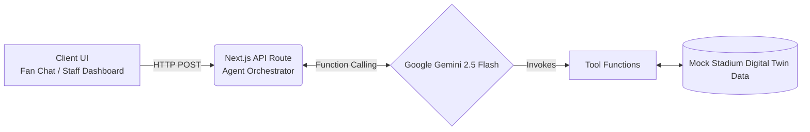

# Stadium Copilot - FIFA World Cup 2026

## 1. Problem Statement & Solution
**Stadium Copilot** is a GenAI-powered agent designed to unify navigation, live crowd management, multilingual assistance, and accessibility into a single, intuitive conversational flow for the upcoming FIFA World Cup 2026. While traditional apps force fans to hunt through menus and static maps, Copilot allows them to simply ask questions in their native language and receive live guidance. Simultaneously, it provides an operational intelligence dashboard for stadium staff, pulling from the exact same live digital twin data to manage congestion proactively.

## 2. Architecture
The application runs on a Next.js App Router full-stack architecture, utilizing Google Gemini 2.5 Flash for rapid function-calling and reasoning.



## 3. Key Features
* **Navigation**: Conversational waypoint routing (e.g., "How do I get to Gate C from the medical station?").
* **Crowd Management**: Real-time crowd level monitoring integrated into routing suggestions.
* **Accessibility**: A strict toggle that forces the LLM to filter paths and facilities for wheelchair and stroller access.
* **Multilingual Assistance**: On-the-fly language switching (English, Hindi, Spanish) via the frontend, dynamically honored by the agent.
* **Operational Intelligence**: A parallel staff dashboard offering live telemetry and AI-generated actionable insights to mitigate congestion.
* **OLED Dark Mode**: A globally accessible dark theme toggle that switches to a deep, high-contrast dark palette, minimizing battery drain on OLED mobile phones for fans attending late matches while promoting digital sustainability.

## 4. Setup Instructions
To run this project locally, simply follow these steps in a clean environment:

```bash
# 1. Clone the repository
git clone <your-repo-url>
cd stadium-copilot

# 2. Install dependencies
npm install

# 3. Setup Environment Variables
cp .env.example .env.local
# Open .env.local and add your actual GEMINI_API_KEY

# 4. Run the development server
npm run dev
```
Navigate to `http://localhost:3000` to talk to the Copilot, and `http://localhost:3000/staff` to view the operations dashboard.

## 5. Live Demo
[View Live Demo on Vercel](https://your-vercel-deployment-url.vercel.app) *(Remember to replace this with your actual URL)*

## 6. Security
We take security seriously, even for a hackathon. See [SECURITY.md](./SECURITY.md) for details on API key isolation, request sanitization, payload limits, and our production roadmap.

## 7. Accessibility
The prototype is built with WCAG AA compliance in mind. See [ACCESSIBILITY.md](./ACCESSIBILITY.md) for our full accessibility audit, including semantic HTML structure, ARIA live regions for screen readers, and focus management.

## 8. Testing
We use **Vitest** for blazing-fast, robust testing. 
Run the suite with:
```bash
npm test
```
**Coverage includes:**
* Data layer integrity and simulated route generation logic (verifying accessible vs non-accessible pathing).
* Error handling and boundary testing for all AI tool functions.
* Integration tests for the `/api/agent` route (featuring mocked LLM responses, sanitization checks, and rate-limit verification).

## 9. Known Limitations
* **Simulated Digital Twin**: To provide a live, responsive experience during the hackathon, the stadium crowd data is a simulated "digital twin" that randomly fluctuates every 5 seconds. In a production environment, this would be wired to physical turnstile sensors and computer vision APIs.
* **Voice Input**: The microphone UI is currently a placeholder to demonstrate the intended mobile-first UX.

## 10. Tech Stack
* **Framework**: Next.js 14 (App Router), React, TypeScript
* **Styling**: Tailwind CSS
* **AI/LLM**: Google Gemini SDK (`gemini-2.5-flash`)
* **Testing**: Vitest
